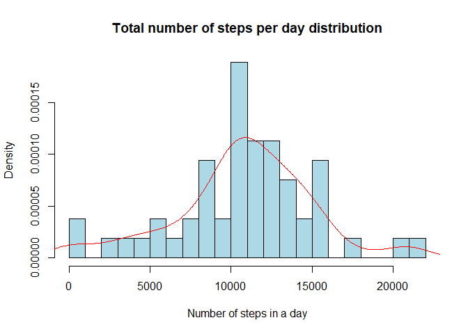
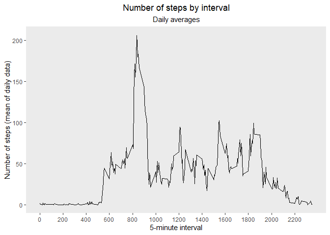
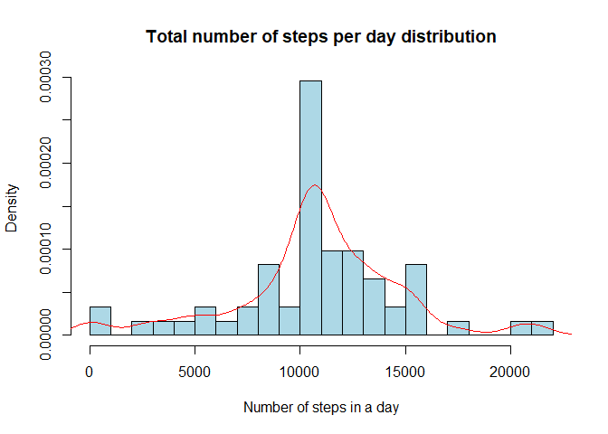
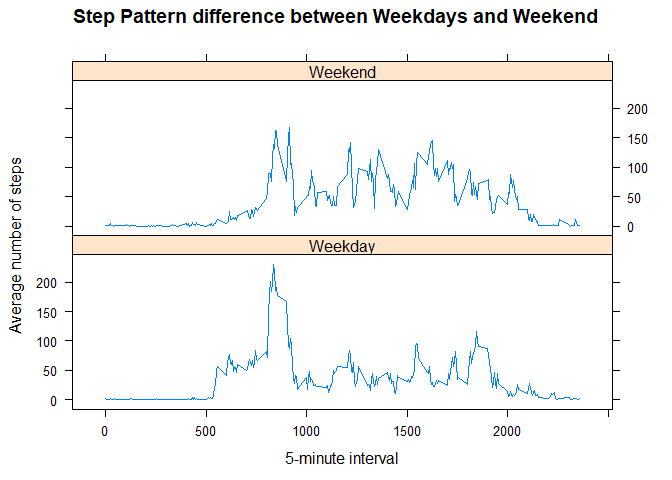

Introduction
------------

This assignment makes use of data from a personal activity monitoring
device. This device collects data at 5 minute intervals through out the
day. The data consists of two months of data from an anonymous
individual collected during the months of October and November, 2012 and
include the number of steps taken in 5 minute intervals each day.

Loading and preprocessing the data
----------------------------------

This section will load the datafile needed to study the activity
monitoring. It also transform loaded file into data.table format, with
date formatting for the *date* variable and numeric format for other
variables.

    library(data.table)
    dtable <- as.data.table(read.csv("activity.csv",header = T,colClasses = c("integer","Date","integer")))
    head(dtable,n=5)

    ##    steps       date interval
    ## 1:    NA 2012-10-01        0
    ## 2:    NA 2012-10-01        5
    ## 3:    NA 2012-10-01       10
    ## 4:    NA 2012-10-01       15
    ## 5:    NA 2012-10-01       20

    tail(dtable,n=5)

    ##    steps       date interval
    ## 1:    NA 2012-11-30     2335
    ## 2:    NA 2012-11-30     2340
    ## 3:    NA 2012-11-30     2345
    ## 4:    NA 2012-11-30     2350
    ## 5:    NA 2012-11-30     2355

It can be seen that there are NA values for the *steps* variable both at
the 5 first and last observations. We can also notice that *interval*
format is an integer which consists on the hour and minutes of the
measure. For instance, 445 means that it is a measure of the steps at
4:45 A.M., also 1935 is a measure at 19:35 P.M.

What is mean total number of steps taken per day?
-------------------------------------------------

### Total step per day computation

In order to analyze the mean total number of steps per day we first must
compute the total number of steps per day. In order to do that we use
the *summarize* function joint with a *group\_by* function.

    library(plyr)
    library(dplyr)

    ## 
    ## Attaching package: 'dplyr'

    ## The following objects are masked from 'package:plyr':
    ## 
    ##     arrange, count, desc, failwith, id, mutate, rename, summarise,
    ##     summarize

    ## The following objects are masked from 'package:data.table':
    ## 
    ##     between, first, last

    ## The following objects are masked from 'package:stats':
    ## 
    ##     filter, lag

    ## The following objects are masked from 'package:base':
    ## 
    ##     intersect, setdiff, setequal, union

    dtable_noNAs <- na.omit(dtable)
    steps_per_day <- group_by(dtable_noNAs,date) %>% summarise(total_steps=sum(steps,na.rm=T))
    head(steps_per_day,n=10)

    ## # A tibble: 10 x 2
    ##    date       total_steps
    ##    <date>           <int>
    ##  1 2012-10-02         126
    ##  2 2012-10-03       11352
    ##  3 2012-10-04       12116
    ##  4 2012-10-05       13294
    ##  5 2012-10-06       15420
    ##  6 2012-10-07       11015
    ##  7 2012-10-09       12811
    ##  8 2012-10-10        9900
    ##  9 2012-10-11       10304
    ## 10 2012-10-12       17382

### Total step per day histogram

Looking for a more clear view of the total steps by day we show the
following histogram of the previously computed variable
(*steps\_per\_day$total\_steps*). Histograms are useful because they
provide us information about the frequency distribution of one variable
that let us to look for extrange behaviors of a variable such as outlier
values, heavy tail tendencies and bimodal distributions.

    with(steps_per_day,{
      hist(total_steps,breaks = 30, freq=F,col="lightblue",
           main="Total number of steps per day distribution",xlab="Number of steps in a day")
      lines(density(total_steps), col="red")
    })

As it can be seen in the histogram, the empirical density distribution
of the total number of steps per day seems similar to a normal
distribution but with heavy tails. In terms of the bars, it can be seen
that it has a very irregular distribution. It can be inferred that the
median should be around 10000 and 11000 of steps per day.

### Mean and median computation

Finally, in order to really observe the meean and median computation we
use the *summary* function.

    steps_per_day_stats <- with(steps_per_day,summary(total_steps))
    steps_per_day_stats

    ##    Min. 1st Qu.  Median    Mean 3rd Qu.    Max. 
    ##      41    8841   10765   10766   13294   21194

The mean total steps per day is 10766 and the median 10765. Both are
almost the same suggesting that the distribution is very centered around
those values.

What is the average daily activity pattern?
-------------------------------------------

### Time series pattern

The following time-series plot intention is to show patterns during the
day in the 5-minutes time intervals. It is like an intra-daily seasonal
plotting in order to look for intervals in which the number of steps is
higher than another (for example, we could expect that during night the
number of steps is much lower than between 6 a.m. and 9 a.m. that is
when people are walking to work).

    library(ggplot2)
    # Compute the interval-mean steps measure
    steps_invervals <- aggregate(steps~interval,dtable_noNAs,mean)
    # Plotting time series
    ggplot(steps_invervals,aes(x=interval,y=steps))+geom_line()+
      labs(x="5-minute interval", y="Number of steps (mean of daily data)",
           title = "Number of steps by interval", 
           subtitle="Daily averages")+
      scale_x_continuous(breaks=seq(0, 2355, 200))+
      theme(plot.title = element_text(hjust = 0.5),
            plot.subtitle = element_text(hjust=0.5),
            panel.grid.major = element_blank(), panel.grid.minor = element_blank())

From the plot it can be confirmed that the number of steps is much
higher during the morning hours and it is around zero during night-time.

### The most intensive stepping interval

We can also find which is the interval that exhibits the maximum mean
number of steps.

    max.interval <- with(steps_invervals,interval[which.max(steps)])
    print(paste("The interval with the maximum mean number of steps is ",max.interval))

    ## [1] "The interval with the maximum mean number of steps is  835"

It turns out that the interval with more intensity is 8:35 a.m.
confirming our expectations.

Imputing missing values
-----------------------

### Missing values counting

The total missing values of the original data base could be computed in
a straightforward way using the *summary* and *is.na* functions:

    summary(is.na(dtable$steps))

    ##    Mode   FALSE    TRUE 
    ## logical   15264    2304

We can see that there are 2304 missing values.

### Filling missing values and new dataset

In order to fill missing values the strategy followed consists on using
daily mean value per interval. It follows the following steps: 1 -
Compute the mean value through days by interval on non-missing
observations. 2 - Replace NA value of a given observation by its
interval mean value.

For the first step we use the same code used before for compute interval
mean through days:

    # Compute mean by interval column
    steps_invervals <- aggregate(steps~interval,dtable_noNAs,mean)
    # Join tables
    ddtable <- as.data.table(join(dtable,steps_invervals,by="interval"))
    colnames(ddtable) <- c("steps","date","interval","steps_fill")

    # Create new database with NAs filled
    steps_filled <- ddtable
    steps_filled$steps <- with(steps_filled,ifelse(is.na(steps),steps_fill,steps))
    steps_filled <- steps_filled[,-("steps_fill")]

Finally the *steps\_filled* is a new database that has three variables:

-   date: date in YYYY-MM-DD format.
-   interval: 5-minute interval value.
-   steps: total number of steps with NAs filled with the average for
    the specific interval.

### Histograms and computations

Now we are going to create an histogram and compute some descriptive
statistics using the new database with no NAs values.

    # Create new summary datatable
    steps_fill_per_day <- group_by(steps_filled,date) %>% summarise(total_steps=sum(steps,na.rm=T))

    # Create histogram
    with(steps_fill_per_day,{
      hist(total_steps,breaks = 30, freq=F,col="lightblue",
           main="Total number of steps per day distribution",xlab="Number of steps in a day")
      lines(density(total_steps), col="red")
    })

    # Compute summary statistics
    steps_fill_per_day_stats <- with(steps_fill_per_day,summary(total_steps))
    steps_fill_per_day_stats

    ##    Min. 1st Qu.  Median    Mean 3rd Qu.    Max. 
    ##      41    9819   10766   10766   12811   21194

The mean total steps per day is 10766 and the median 10766. Before
computed values were 10766 and the median 10765 respectively. Both are
almost the same, possibly due to the fact that mean values per interval
were applied to each missing value making it to converve to the mean and
median value.

Are there differences in activity patterns between weekdays and weekends?
-------------------------------------------------------------------------

### Creating the factor variable

This part will be in charge of creating the factor variable called
weekend, that will assign 1 to weekends and 0 in other case.

    # Change local time (because my country is Spanish based)
    Sys.setlocale("LC_TIME", "English")

    ## [1] "English_United States.1252"

    steps_filled[,weekend:=ifelse(weekdays(date)=="Sunday"|weekdays(date)=="Saturday",1,0)]

    # Converting to factor variables with descriptive labels
    steps_filled$weekend <-factor(steps_filled$weekend,labels = c("Weekday","Weekend"))

### Plotting time

    # Compute the weekend/weekday-mean steps measure
    steps_filled_av <- aggregate(steps~interval+weekend,steps_filled,mean)
    library(lattice)
    xyplot(steps~interval|weekend,data=steps_filled_av,layout=c(1,2),
           type="l",xlab = "5-minute interval",ylab="Average number of steps",
           main="Step Pattern difference between Weekdays and Weekend")

From the previous plot it can be inferred that the weekends exhibits
less steps than the weekdays. On the other hand, weekend steps are less
dispersed than for the weekday case.
